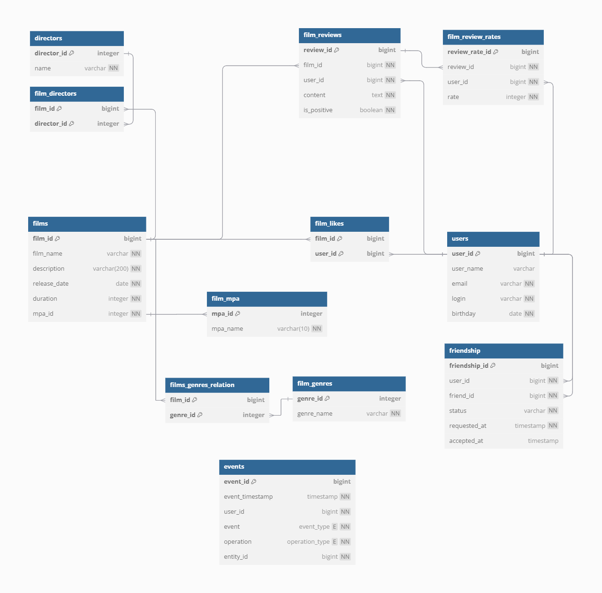

# Фильмотоп

Приложение позволяет искать и оценивать фильмы, а также заводить новых друзей.

## Схема БД

Схема БД приведена ниже



## API

### Режиссеры
`GET /directors`
возвращает всех режиссеров

`GET /directors/{id}`
возвращает режиссера по id

`POST /directors`
создает режиссера, в теле передается:
   ```json
   {
      "id": 10,
      "name": "Director"
   }
   ```

`PUT /directors`
изменяет режиссера, в теле передается:
   ```json
   {
      "id": 10,
      "name": "Director"
   }
   ```

`DELETE /directors/{id}`
удаляет режиссера по id

`DELETE /directors`
удаляет всех режиссеров

### Фильмы

`GET /films`
возвращает все фильмы

`GET /films/{id}`
возвращает фильм по id

`GET /films/search?query=string&by=attributes`
возвращает список фильмов, отсортированных по популярности

Параметры строки запроса
- query — текст для поиска
- by — может принимать значения director (поиск по режиссёру), title (поиск по названию), либо оба значения через запятую при поиске одновременно и по режиссеру и по названию.

Пример: `GET /films/search?query=крад&by=director,title`

`GET /films/common?userId=id1&friendId=id2`
возвращает список общих для двух пользователей фильмов

`GET /films/director/{directorId}?sortBy=[year,likes]`
возвращает список фильмов режиссера отсортированных по количеству лайков или году выпуска.

`POST /films`
создает фильм, в теле передается:
```json
{
   "name": "Some name",
   "description": "Some description",
   "releaseDate": "1967-03-25",
   "duration": 100,
   "mpa": { "id": 1},
   "directors": [
      { "id": 1 }
   ],
   "genres": [
      { "id": 2 }
   ]
}
```

`PUT /films`
изменяет фильм, в теле передается сообщение того же формата, что и при создании фильма, но дополнительно передается id

`DELETE /films/{id}`
удаляет фильм по id

`DELETE /films`
удаляет все фильмы

### Отзывы

`GET /reviews`
возвращает все отзывы

`GET /reviews/{id}`
возвращает отзыв по id

`POST /reviews`
создает отзыв, в теле передается: 
```json
{
  "content": "This film is soo bad.",
  "isPositive": false,
  "userId": 1,
  "filmId": 1
}
```

`PUT /reviews`
изменяет отзыв, в теле передается сообщение того же формата, что и при создании, но дополнительно передается id

`DELETE /reviews`
удаляет все отзывы

`DELETE /reviews/{id}`
удаляет отзыв по id

`PUT /reviews/{id}/like/{userId}`
пользователь userId ставит лайк отзыву id

`PUT /reviews/{id}/dislike/{userId}`
пользователь userId ставит дизлайк отзыву id

`DELETE /reviews/{id}/like/{userId}`
пользователь userId удаляет лайк отзыву id

`DELETE /reviews/{id}/dislike/{userId}`
пользователь userId удаляет дизлайк отзыву id

### Друзья

`GET /users/{id}/friends`
возвращает всех друзей пользователя id

`GET /users/{id}/friends/common/{otherId}`
возвращает всех общих друзей для двух пользователей id и otherId

`PUT /users/{id}/friends/{friendId}`
добавляет пользователя friendId в друзья пользователю id

`DELETE /users/{id}/friends/{friendId}`
удаляет пользователя friendId из друзей пользователя id

### Жанры

`GET /genres`
возвращает все жанры

`GET /genres/{id}`
возвращает жанр по id

### Лайки 

`GET /films/popular?count={limit}&genreId={genreId}&year={year}`
возвращает список самых популярных фильмов указанного жанра за нужный год
Ни один параметр не является обязательным:
- если не указан count - возвращаются 10 фильмов
- если не указан genreId - возвращаются фильмы всех жанров
- если не указан year - возвращаются фильмы всех годов выпуска

`PUT /films/{filmId}/like/{userId}`
пользователь userId ставить лайк фильму filmId

`DELETE /films/{filmId}/like/{userId}`
пользователь userId ставит дизлайк фильму filmId

### Рейтинг MPA

`GET /mpa`
возвращает все рейтинги

`GET /mpa/{id}`
возвращает рейтинг по id

### Пользователи

`GET /users`
возвращает всех пользователей

`GET /{id}`
возвращает пользователя по id

`GET /{id}/recommendations`
возвращает рекомендации по фильмам для просмотра для пользователя id

`POST /users`
создает пользователя, в теле передается:
```json
{
  "login": "dolore",
  "name": "Nick Name",
  "email": "mail@mail.ru",
  "birthday": "1946-08-20"
}
```

`PUT /users`
изменяет пользователя, в теле передается сообщение того же формата, что и при создании, но дополнительно передается id

`DELETE /users`
удаляет всех пользователей

`DELETE /users/{id}`
удаляет пользователя по id

`DELETE /users/{id}/feed`
возвращает ленту событий пользователя id

## Запросы БД, обеспечивающие обработку методов API

1. Получение всех фильмов
    ```sql
   SELECT f.film_id as "film_id",
          f.film_name as "film_name",
          f.description as "description",
          f.release_date as "release_date",
          f.duration as "duration",
          fr.mpa_id as "mpa_id",
          fr.mpa_name as "mpa_name",
          count(fl.film_id) as "rate"
   FROM films f
   INNER JOIN film_mpa fr ON f.mpa_id = fr.mpa_id
   LEFT JOIN film_likes fl ON fl.film_id = f.film_id
   GROUP BY f.film_id, fr.mpa_id;
    ```
1. Получение фильма по id
    ```sql
   SELECT f.film_id as "film_id",
          f.film_name as "film_name",
          f.description as "description",
          f.release_date as "release_date",
          f.duration as "duration",
          fr.mpa_id as "mpa_id",
          fr.mpa_name as "mpa_name",
          count(fl.film_id) as "rate"
   FROM films f
   INNER JOIN film_mpa fr ON f.mpa_id = fr.mpa_id
   LEFT JOIN film_likes fl ON fl.film_id = f.film_id
   WHERE f.film_id = :filmId
   GROUP BY f.film_id, fr.mpa_id;
    ```
1. Создание фильма
    ```sql
    INSERT INTO films(film_name, description, release_date, duration, mpa_id)
    VALUES (:name, :description, :releaseDate, :duration, :mpaId);
   
    INSERT INTO film_genres (film_id, genres_id) 
    VALUES (:filmId, :genresId);
    ```
1. Обновление фильма
    ```sql
   UPDATE films
   SET film_name = :name,
       description = :description,
       release_date = :releaseDate,
       duration = :duration,
       mpa_id = :mpaId
   WHERE film_id = :filmId;
    ```
1. Удаление всех фильмов
    ```sql
    DELETE FROM films;
    ```
1. Удаление фильма по id
    ```sql
   DELETE FROM films
   WHERE film_id = :filmId;
    ```
1. Топ 10 фильмов
    ```sql
   SELECT f.film_id as "film_id",
          f.film_name as "film_name",
          f.description as "description",
          f.release_date as "release_date",
          f.duration as "duration",
          fr.mpa_id as "mpa_id",
          fr.mpa_name as "mpa_name",
          count(fl.film_id) as "rate"
   FROM films f
   INNER JOIN film_mpa fr ON f.mpa_id = fr.mpa_id
   LEFT JOIN film_likes fl ON fl.film_id = f.film_id
   GROUP BY f.film_id, fr.mpa_id
   ORDER BY count(fl.film_id) desc
   LIMIT :count;
    ```
1. Поставить фильму лайк
    ```sql
   INSERT INTO film_likes (film_id, user_id)
   VALUES (:filmId, :userId);
    ```
1. Убрать у фильма лайк
    ```sql
   DELETE FROM film_likes
   WHERE film_id = :filmId AND user_id = :userId;
    ```
1. Получение всех пользователей
    ```sql
   SELECT user_id as "user_id",
          user_name as "user_name",
          email as "email",
          login as "login",
          birthday as "birthday"
   FROM users;
    ```
1. Получение пользователя по id
    ```sql
   SELECT * FROM users
   WHERE user_id = :id;
    ```
1. Создание пользователя
    ```sql
   INSERT INTO users(user_name, email, login, birthday)
   VALUES (:name, :email, :login, :birthday);
    ```
1. Обновление пользователя
    ```sql
   UPDATE users SET user_name = :name, email = :email, login = :login, birthday = :birthday
   WHERE user_id = :id;
    ```
1. Удаление всех пользователей
    ```sql
    DELETE FROM users;
    ```
1. Удаление пользователя по id
    ```sql
   DELETE FROM users
   WHERE user_id = :id;
    ```
1. Получение друзей пользователя
    ```sql
   SELECT friend_id
   FROM friendship
   WHERE user_id = :userId

   UNION

   SELECT user_id
   FROM friendship
   WHERE friend_id = :userId AND status = 'accepted'
    ```
1. Получение общих друзей
   ```sql
     (SELECT friend_id
     FROM friendship
     WHERE user_id = :id1
   
     UNION
   
     SELECT user_id
     FROM friendship
     WHERE friend_id = :id1 AND status = 'accepted')
   
     INTERSECT
   
     (SELECT friend_id
     FROM friendship
     WHERE user_id = :id2
   
     UNION
   
     SELECT user_id
     FROM friendship
     WHERE friend_id = :id2 AND status = 'accepted');
   ```
1. Добавить друга
    ```sql
    INSERT INTO friendship (friend_id, user_id, status, requested_at)
     VALUES (:friendId, :userId, :status, :requestedAt);
    ```
1. Удаление из друзей 
    ```sql
   DELETE FROM friendship
   WHERE friend_id = :friendId AND user_id = :userId
    ```